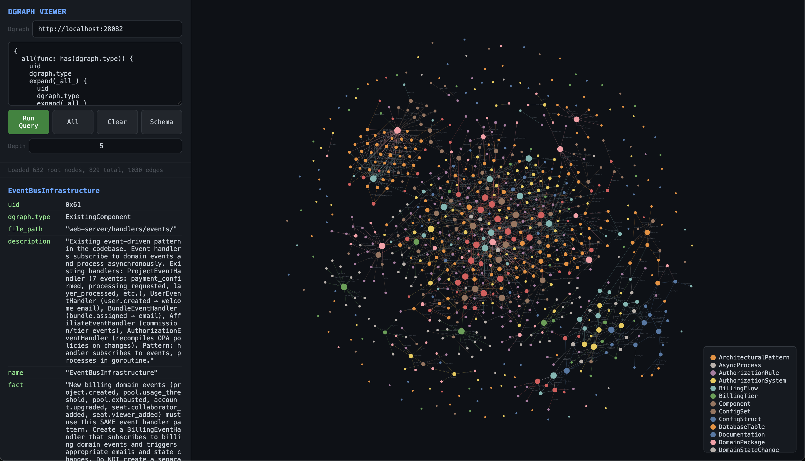

# Dgraph Viewer

> **Note:** This project is open source and will remain so, but additional development (including WebGPU for much greater throughput) will occur on a separate, private repository. Your contributions are appreciated. To use the licensed version of the 3D graph viewer, reach out: **hello@corewood.io**

A lightweight, browser-based graph explorer for [Dgraph](https://dgraph.io) databases. Inspired by the Neo4j browser, built as a single Go binary with zero dependencies.

<p align="center">
  
</p>

## Features

### Visualization

- **3D and 2D modes** — toggle between a Three.js 3D scene and a D3.js SVG view; graph state is preserved across switches
- **Force-directed layout** — custom 3D force simulation (octree-based n-body) in 3D mode, D3 force simulation in 2D
- **Cesium-style camera** — orbit, pan, tilt, free-look, and zoom with inertia and damping in 3D mode
- **Orientation gizmo** — XYZ axis indicator synced to the camera in 3D mode
- **Shape by type** — each `dgraph.type` gets a distinct platonic solid (icosahedron, octahedron, dodecahedron, tetrahedron, cube, sphere) in both 2D and 3D
- **Color by type** — nodes colored by `dgraph.type`, with auto-generated legend
- **Size by degree** — node radius scales logarithmically with connection count (toggle on/off)
- **Source-colored edges** — lines inherit the color of their origin node
- **Atmospheric fog** — exponential fog in 3D adds depth cues to large graphs

### Interaction

- **DQL query editor** — write and run arbitrary DQL queries with Cmd/Ctrl+Enter
- **Expand on double-click** — fetch and render a node's edges incrementally
- **Radial glow highlighting** — hover a node to see BFS-ranked connections fade over configurable depth (1–20 ranks)
- **Focus mode** — click a node to isolate its neighborhood; non-connected nodes and edges are hidden
- **Node inspector** — sidebar shows all properties and clickable edge links
- **Node dragging** — shift+drag a node in 3D (plain drag in 2D) to reposition it within the simulation
- **Arrow key Z-axis** — push a selected node along the Z-axis with arrow keys in 3D
- **Active node pulse** — selected node throbs and brightens to stay visible
- **Reset view** — snap the camera back to fit the graph

### Data & Connectivity

- **Live target switching** — change the Dgraph address in the UI without restarting
- **Session-based connections** — each browser tab gets its own session with connection pooling and idle reaping
- **Read-only** — all mutations are blocked at the proxy layer
- **Schema viewer** — inspect predicates, types, indexes, and tokenizers

## Requirements

- Go 1.22+ (for building from source)
- **Or** Podman / Docker (for running the container image)
- A running Dgraph instance with the HTTP API exposed (default: `localhost:28028`)

## Running Dgraph

A ready-to-use Dgraph stack is included in `dgraph/`. It runs Dgraph Zero, Alpha, Ratel, and a Caddy reverse proxy behind a single port using Podman Compose.

### Install Podman

| Platform | Install | Link |
|---|---|---|
| **macOS** | `brew install podman podman-compose` | [podman.io/docs/installation#macos](https://podman.io/docs/installation#macos) |
| **Linux** | Package manager (apt, dnf, pacman, etc.) | [podman.io/docs/installation#linux](https://podman.io/docs/installation#linux) |
| **Windows** | Podman Desktop installer or `winget install RedHat.Podman` | [podman.io/docs/installation#windows](https://podman.io/docs/installation#windows) |

After installing, initialize the Podman machine (macOS/Windows only):

```bash
podman machine init
podman machine start
```

### Start Dgraph

```bash
cd dgraph
podman compose up -d
```

This exposes Dgraph on `localhost:28028` (Caddy proxies Alpha API + Ratel UI on a single port).

To use a different port:

```bash
GRAPH_PORT=9080 podman compose up -d
```

### Verify

```bash
# Health check
curl http://localhost:28028/health

# Open Ratel UI
open http://localhost:28028
```

### Stop / Reset

```bash
# Stop (preserves data)
podman compose down

# Stop and delete all data
podman compose down -v
```

### What's in the stack

| Service | Image | Role |
|---|---|---|
| **Zero** | `dgraph/dgraph:v24.0.5` | Cluster coordination, shard management |
| **Alpha** | `dgraph/dgraph:v24.0.5` | Query/mutation API (HTTP + gRPC) |
| **Ratel** | `dgraph/ratel:v21.12.0` | Web-based Dgraph UI |
| **Caddy** | `caddy:2-alpine` | Reverse proxy — routes `/query`, `/mutate`, `/alter`, `/health`, `/admin` to Alpha; everything else to Ratel |
| **Viewer** | Built from `Containerfile` | Graph explorer UI — connects to Dgraph via Caddy |

## Quick Start

```bash
# Build and run in the background
make start

# Open in browser
open http://localhost:18080

# Check running instances
make status

# Stop
make stop
```

Or run directly:

```bash
go run . -dgraph http://localhost:28028 -port 18080
```

## Container

The viewer ships as a `Containerfile` for Podman or Docker.

### Build the image

```bash
podman build -t dgraph-viewer .
```

### Run standalone

Point the container at your Dgraph instance using `DGRAPH_HTTP`:

```bash
podman run --rm -p 18080:18080 \
  -e DGRAPH_HTTP=http://host.containers.internal:28028 \
  dgraph-viewer
```

> **Note:** Use `host.containers.internal` (Podman) or `host.docker.internal` (Docker) to reach services on the host machine from inside the container.

Override the viewer port:

```bash
podman run --rm -p 9090:9090 \
  -e DGRAPH_HTTP=http://host.containers.internal:28028 \
  dgraph-viewer -port 9090
```

### Run with Compose

The `dgraph/compose.yml` includes the viewer alongside the full Dgraph stack. One command brings up everything:

```bash
cd dgraph
podman compose up -d
```

| Service | Default port | Override |
|---|---|---|
| Dgraph (Caddy) | 28028 | `GRAPH_PORT` |
| Viewer | 18080 | `VIEWER_PORT` |

The viewer connects to Dgraph internally via the compose network — no host port mapping needed for that link.

```bash
# Custom ports
GRAPH_PORT=9080 VIEWER_PORT=8080 podman compose up -d
```

## Makefile

| Target | Description |
|---|---|
| `make start` | Build and start in the background (logs to `/tmp/dgraph-viewer.<port>.log`) |
| `make stop` | Stop the running instance |
| `make restart` | Stop then start |
| `make status` | Show all running instances and their ports/PIDs |

Override the port: `make start PORT=9090`

## Configuration

### Dgraph Address

Set the target Dgraph instance using any of these methods (in order of precedence):

```bash
# Flag
go run . -dgraph http://dgraph-host:8080

# Environment variable
DGRAPH_HTTP=http://dgraph-host:8080 go run .

# In the UI
# Edit the "Dgraph" field at the top of the sidebar — connection switches live
```

## Usage

### Running Queries

Write DQL in the query editor and press **Cmd+Enter** (or click **Run Query**). Results are parsed and rendered as an interactive graph.

Example — load all typed nodes:

```dql
{
  all(func: has(dgraph.type)) {
    uid
    dgraph.type
    expand(_all_) {
      uid
      dgraph.type
      expand(_all_)
    }
  }
}
```

Or just click the **All** button.

### Exploring the Graph

| Action | Effect |
|---|---|
| **Hover** a node | Highlights connected nodes with radial glow; shows labels along the chain |
| **Click** a node | Inspects it in the sidebar (properties, edges); in focus mode, isolates its neighborhood |
| **Double-click** a node | Expands its edges by fetching from Dgraph |
| **Shift+drag** a node (3D) | Repositions it within the force simulation |
| **Drag** a node (2D) | Repositions it within the force simulation |
| **Arrow Up/Down** (3D) | Pushes the selected node along the Z-axis |
| **Scroll** | Zoom in/out |
| **Left-drag** (3D) | Orbit the camera |
| **Right-drag** (3D) | Zoom |
| **Middle-drag** (3D) | Tilt |
| **Ctrl+drag** (3D) | Free-look |
| **Drag background** (2D) | Pan the canvas |

### Controls

| Control | Description |
|---|---|
| **2D / 3D toggle** | Switch between D3 SVG and Three.js rendering modes |
| **Dgraph** | Target Dgraph HTTP address — edits switch the connection live |
| **Run Query** | Execute the DQL query (also Cmd/Ctrl+Enter) |
| **All** | Load all nodes with `dgraph.type` |
| **Clear** | Remove all nodes and edges from the canvas |
| **Reset** | Fit the camera/viewport to the current graph |
| **Schema** | Display the database schema in the sidebar |
| **Depth** | Number of ranks for the highlight chain (default: 5) |
| **Shapes** | Toggle platonic-solid shapes per type (vs. spheres/circles) |
| **Scale** | Toggle degree-based node sizing |
| **Focus** | Toggle focus mode — clicking a node isolates its neighborhood |

## Architecture

```
dgraph_viewer/
├── Containerfile        # Multi-stage container build (Go build → Alpine runtime)
├── dgraph/
│   ├── compose.yml      # Podman Compose stack (Zero + Alpha + Ratel + Caddy + Viewer)
│   └── Caddyfile        # Reverse proxy config — single port for all services
├── main.go              # HTTP server, Dgraph proxy, session/connection pooling
├── ui.go                # Embeds static/ via go:embed
├── static/
│   ├── index.html       # Single-page UI shell
│   └── js/
│       ├── state.js     # Graph data structures, colors, helpers
│       ├── materials.js # Three.js geometries, materials, simulation ref
│       ├── data.js      # Node/link ingestion from Dgraph JSON
│       ├── query.js     # Query execution, expand, clear, schema, reset
│       ├── force3d.js   # Custom 3D force simulation (octree + n-body)
│       ├── controls.js  # Cesium-style 3D camera controls
│       ├── scene.js     # 3D mesh building, link geometry, render loop
│       ├── highlight.js # 3D BFS raycasting and glow highlighting
│       ├── focus.js     # Focus mode (BFS neighborhood isolation)
│       ├── mode2d.js    # 2D SVG renderer (D3 force + shapes)
│       ├── gizmo.js     # 3D orientation gizmo (XYZ axes)
│       ├── animate.js   # Animation loop, active-node pulse, gizmo sync
│       └── ui.js        # Sidebar, legend, option toggles, mode switching
├── Makefile             # start/stop/restart/status targets
└── go.mod               # Go module (zero external dependencies)
```

The server is a thin HTTP proxy:
- `GET /` — serves the embedded single-page UI
- `POST /api/query` — forwards DQL queries to Dgraph (blocks mutations)
- `GET /api/schema` — fetches the Dgraph schema
- `GET/PUT /api/config` — read/update the target Dgraph address at runtime
- `POST /api/disconnect` — tears down the current Dgraph connection

All communication with Dgraph uses the HTTP `/query` endpoint. No gRPC dependency.

## Safety

- **No mutations** — the proxy rejects any query containing `mutation`, `delete`, or `set {`
- **Read-only by design** — there is no write path in the API
- **Local only** — the server binds to `localhost` by default

## License

See [License](./LICENSE)
